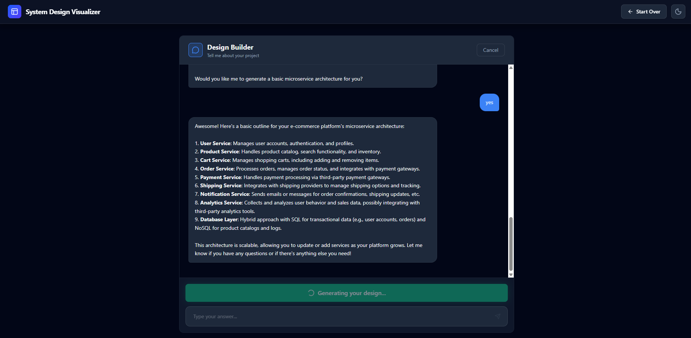

# System Design Visualizer

An interactive tool that transforms static system design diagrams into explorable, interactive visualizations using AI. Now with **AI Chat Builder** - design your architecture from scratch through conversation!

## 📸 Screenshots


*Original Image and Mermaid Diagram side-by-side*


*Interactive React Flow Graph*


*AI Chat Builder - Design your system through conversation*

## 🚀 Features

### 🔑 Bring Your Own Key (NEW!)
- **OpenAI & Gemini Support**: Use your own API keys for unlimited usage.
- **Secure Storage**: Keys are stored locally in your browser (LocalStorage) and never sent to our servers.
- **Model Selection**: Choose between GPT-4o and Gemini 1.5 Pro/Flash for generation.

### 📤 Image Upload Mode
- **AI-Powered Analysis**: Upload any system design image (architecture diagrams, flowcharts, etc.)
- **Mermaid Generation**: Automatically converts images into editable Mermaid.js diagrams
- **Interactive Visualization**: Converts Mermaid diagrams into interactive React Flow graphs

### 💬 Chat Builder Mode
- **Conversational Design**: Tell the AI about your project and it asks intelligent follow-up questions
- **Smart Questionnaire**: Covers project type, scale, features, data needs, and integrations
- **Auto-Generation**: After 5-7 exchanges, generates a complete microservice architecture (7-15 components)
- **No Diagram Needed**: Perfect when you don't have an existing architecture diagram

### 🎨 Common Features
- **Deep Dive**: Click on any component (Load Balancer, Database, etc.) to see inferred details like technology stack and role
- **Premium UI**: A modern, dark/light themed dashboard with zoom, pan, and copy controls
- **Mock Mode**: Works without API key using sample data for testing

## 🛠️ Tech Stack

- **Frontend**: React 19, Vite 7, Tailwind CSS 4
- **Visualization**: React Flow, Mermaid.js
- **AI**: OpenAI GPT-4o, Google Gemini 1.5 Pro
- **Icons**: Lucide React

## 🏃‍♂️ Running Locally

### Prerequisites

- Node.js (v18 or higher)
- An OpenAI or Gemini API Key (optional - for AI features)

### Installation

1. **Clone the repository**
   ```bash
   git clone https://github.com/Piyush-sahoo/System-Design.git
   cd System-Design
   ```

2. **Install dependencies**
   ```bash
   npm install
   ```

3. **Start the Development Server**
   ```bash
   npm run dev
   ```

4. **Configure API Keys**
   - Click the **Settings** (gear icon) in the top right corner.
   - Enter your OpenAI or Gemini API key.
   - Keys are saved locally.

5. **Open in Browser**
   Navigate to `http://localhost:5173` to see the app in action.

## 📸 Workflow

### Option 1: Upload Image
1. **Choose**: Select "Upload Image" from the landing page
2. **Upload**: Drag & drop your system design image
3. **Review**: See the generated Mermaid diagram code and preview
4. **Convert**: Click "Convert to Interactive" to generate the node-based graph
5. **Explore**: Interact with the graph nodes to learn more about your system

### Option 2: Chat Builder
1. **Choose**: Select "Build from Scratch" from the landing page
2. **Chat**: Answer the AI's questions about your project (type, scale, features, etc.)
3. **Generate**: After 5-7 exchanges, click "Generate System Design"
4. **Explore**: View your auto-generated Mermaid diagram and interactive graph

## 🤝 Contributing

Contributions are welcome! Please feel free to submit a Pull Request.

## 📄 License

MIT License

---

### ❤️ About Me

**Built with love by [Piyush](https://github.com/Piyush-sahoo)**

Integrating AI to make complex system design accessible to everyone.


This project is licensed under the MIT License.
